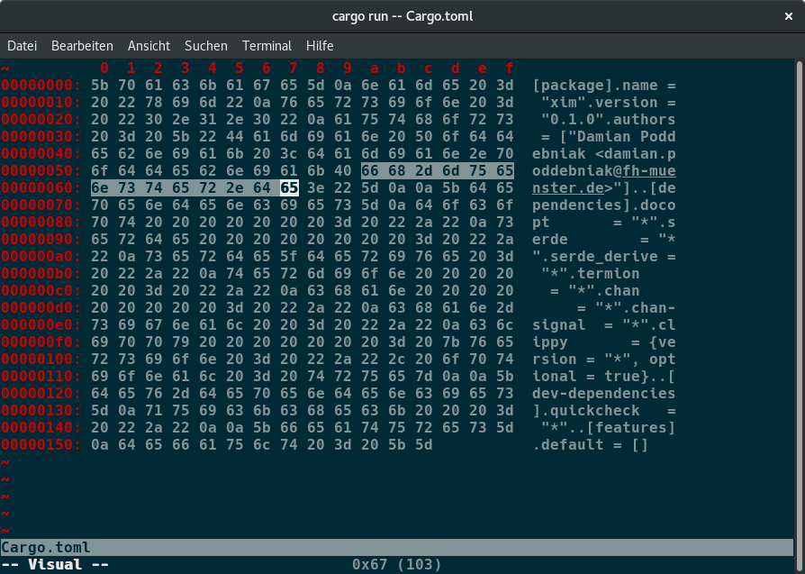

# Xim (untested)

Xim is useful for simple hex editing tasks. However, it is not thoroughly tested and may consume much memory. Use at your own risc.



## Installation

### Install Rustup

Arch Linux:

```
$ sudo pacman -S rustup
```

Others:

```
$ curl https://sh.rustup.rs -sSf | sh
```

### Update/Install Toolchain

```
$ rustup install stable
$ rustup update
```

## Build Xim

```
$ cargo build
```

## Run Xim

Test with

```
$ cargo run -- <file>
```

or build in release mode

```
$ cargo build --release
$ ./target/release/xim <file>
```

# Usecases

* [x] Open/Create
* [ ] Open/Create with `:e <file>`
* [x] Save with `:w`
* [ ] Save as with `:w <file>`
* [x] Save and exit with `:x` or `:wq`
* [x] Exit with `:q` or `:q!`
* [x] Statusbar (State, Position)
* [x] Move
* [x] Jump
* [ ] Jump to Start/End `gg`, `G`
* [ ] Relative Jumps
* [x] Scroll
* [x] Insert
* [x] Delete
* [x] Replace
* [x] Visual mode
* [x] Copy/Paste
* [ ] Edit in ASCII mode (partially implemented)
* [x] Undo/Redo
* [ ] Highlite differences

# Efficiency

* [ ] Portable colors
* [ ] Optimize drawing (avoid flickering)
* [ ] Persistent rope
* [ ] Lazy loading/unloading of memory pages
* [ ] Efficient saving
